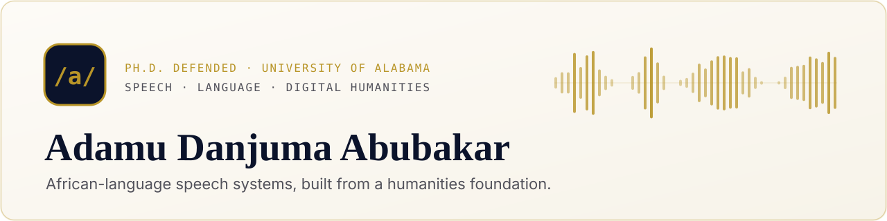

<picture>
  <source media="(prefers-color-scheme: dark)" srcset="assets/banner-dark.svg">
  
</picture>

  
  
  
  
  
  

## Work with me

Roles, fellowships, consulting, collaborations. Speech and language — computational linguistics, digital humanities, multilingual NLP. Applied AI and software-engineering titles are in scope when that is how the team names the work.

African-language speech is what I have shipped. It does not have to be the mandate of the lab or company.

## Selected work

<table>
  <tr>
    <td width="50%" valign="top">
      SPEECH &amp; LANGUAGE 
      <a href="https://app.murya.ng"><b>Murya</b></a> 
      Hausa speech in the browser — speech, chat, translation, dictionary. 
      <a href="https://huggingface.co/adab-tech/murya-piper-hausa-tts">TTS model</a> · 8 voices · Piper/ONNX on CPU · CC BY-NC-SA 4.0
    </td>
    <td width="50%" valign="top">
      DIGITAL HUMANITIES 
      <a href="https://adamu.tech/mapping/"><b>Mapping Voices</b></a> 
      Open atlas of oral-history and voice-testimony archives, filterable by country, theme, language and decade. 
      <a href="https://github.com/adab-tech/mapping">code</a> · MIT · dataset CC BY 4.0
    </td>
  </tr>
  <tr>
    <td width="50%" valign="top">
      DATA 
      <a href="https://huggingface.co/datasets/adab-tech/murya-hausa-en-lexicon-robinson1914"><b>Robinson Hausa–English lexicon</b></a> 
      20,628 word/phrase pairs parsed from Robinson's 1914 dictionary. 
      Hugging Face dataset
    </td>
    <td width="50%" valign="top">
      PLATFORM 
      <a href="https://globalopportunities.app"><b>Global Opportunities</b></a> 
      Scholarships, fellowships, grants and jobs with plain-English summaries, refreshed automatically. 
      <a href="https://github.com/adab-tech/globalopportunities">code</a> · FastAPI · Postgres · Cloudflare Workers
    </td>
  </tr>
</table>

**Also built:** [Imodoye](https://imodoye.ng) (writers' residency platform) · [adab.ng](https://adab.ng) (real-estate site with lister and tenant portals) · [Bama PickMe](https://github.com/adab-tech/bama-pickme) (campus donation and exchange app, Android) · [Adamsy Free TV](https://github.com/adab-tech/adamsy-free-tv) (free-to-air TV client)

<code>/a/</code> · <a href="https://adamu.tech">adamu.tech</a>

