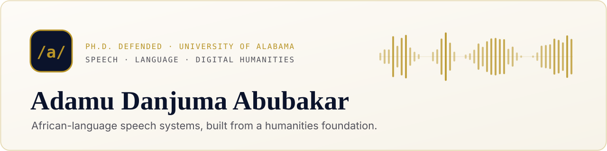

<picture>
  <source media="(prefers-color-scheme: dark)" srcset="assets/banner-dark.svg">
  
</picture>

  
  
  
  
  
  

## Overview

I am a Ph.D. Candidate at the University of Alabama researching computational linguistics, digital humanities, and low-resource speech synthesis. My engineering work bridges phonetic theory, acoustic modeling, and modern web systems to build practical voice and language infrastructure for African languages.

Alongside speech systems research, I design and deploy applied AI platforms for complex data landscapes—from biomedical rare disease knowledge graphs to spatial humanities archives.

---

## Flagship Systems & Research

### 1. [Murya](https://murya.ng) — African-Language Neural Speech System
- **Repository:** [`adab-tech/hausa-ai`](https://github.com/adab-tech/hausa-ai) · **Live:** [murya.ng](https://murya.ng)
- **Role:** Creator & Lead Engineer
- The first production-grade neural text-to-speech platform specifically engineered for Hausa and low-resource Chadic languages.
- Features end-to-end acoustic modeling, custom tone and vowel-length normalization, studio voice cloning, and low-latency client synthesis.
- **Stack:** PyTorch, FastAPI, Hugging Face, Next.js, Web Audio API, Docker

### 2. [Robinson Hausa–English Lexical Dataset](https://huggingface.co/datasets/adab-tech/murya-hausa-en-lexicon-robinson1914)
- **Dataset:** [`adab-tech/murya-hausa-en-lexicon-robinson1914`](https://huggingface.co/datasets/adab-tech/murya-hausa-en-lexicon-robinson1914)
- Curated and parsed digitized open lexicon spanning thousands of headwords from historical Chadic linguistic corpora.
- Built to provide structured phonetic, morphological, and orthographic ground-truth data for speech synthesis and NLP benchmarks.
- **Format:** Parquet, Hugging Face Datasets API, automated validation pipelines

### 3. [Constellation: AI Rare Disease Atlas](https://rare-disease-atlas.lovable.app)
- **Repository:** [`adab-tech/rare-disease-atlas`](https://github.com/adab-tech/rare-disease-atlas-41a921d6) · **Live:** [rare-disease-atlas.lovable.app](https://rare-disease-atlas.lovable.app)
- Evidence-grounded biomedical graph connecting orphan diseases, causal gene variants, HPO phenotypes, and clinical trials.
- Features real-time clinical intake parsing, contradiction radar across competing scientific literature, and latent drug repurposing pathfinders.
- **Stack:** TanStack Start, React 19, Tailwind CSS, shadcn/ui, D3 force simulation, Bright Data API

### 4. [Mapping Voices](https://adamu.tech/mapping/) — Oral History & Voice Testimony Atlas
- **Repository:** [`adab-tech/mapping`](https://github.com/adab-tech/mapping) · **Live:** [adamu.tech/mapping](https://adamu.tech/mapping/)
- Spatial humanities platform mapping oral narratives, dialectal variations, and historical audio recordings across West Africa.
- Interactive cartography paired with bilingual transcripts, acoustic waveform players, and archival metadata schemas.
- **Stack:** Leaflet / Mapbox GL, Web Audio, Jekyll / GitHub Pages

### 5. [Global Opportunities](https://globalopportunities.app)
- **Repository:** [`adab-tech/globalopportunities`](https://github.com/adab-tech/globalopportunities) · **Live:** [globalopportunities.app](https://globalopportunities.app)
- Aggregation and matching platform connecting African researchers, graduate students, and builders with international fellowships, conferences, and grants.
- Filterable by academic discipline, funding tier, and geographic eligibility.

---

## Technical Toolkit

| Domain | Technologies & Frameworks |
|---|---|
| **Speech & NLP** | PyTorch, Hugging Face (Transformers/Datasets), Librosa, Montreal Forced Aligner, FastSpeech2 / VITS, Piper |
| **Backend & Cloud** | Python, FastAPI, Node.js / Bun, PostgreSQL / Supabase, Docker, Redis, REST / GraphQL APIs |
| **Frontend & Systems** | TypeScript, React, Next.js, TanStack Start, Tailwind CSS, shadcn/ui, D3.js |
| **Linguistics & DH** | Phonetics, Orthography Standardization, Chadic Dialectology, TEI/XML, Text Mining |

---

## Research & Academic Background

- **Ph.D. Candidate** — University of Alabama (Interdisciplinary Computational Linguistics & Digital Humanities)
- **Research Focus:** Computational phonetics, speech corpus curation for low-resource languages, tone preservation in neural synthesis, and digital cultural archives.
- **Publications & Preprints:** Track my citations and academic preprints on [Google Scholar](https://scholar.google.com/citations?hl=en&user=08cPiU8AAAAJ).

---

## Connect & Collaborate

- **Personal Domain:** [adamu.tech](https://adamu.tech)
- **Curriculum Vitae:** [adamu.tech/cv](https://adamu.tech/cv)
- **LinkedIn:** [linkedin.com/in/adamudanjuma](https://www.linkedin.com/in/adamudanjuma/)
- **Direct Inquiries:** [contact@adamu.tech](mailto:contact@adamu.tech)
